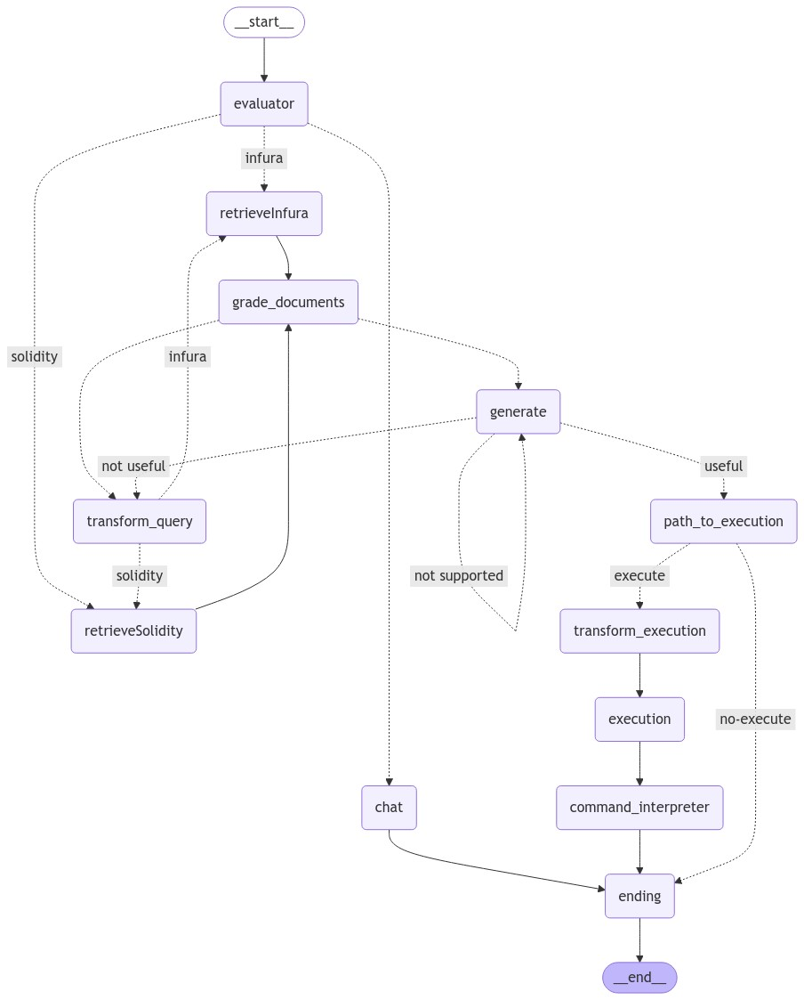

# Web3Buddy

## Watch the [Demo Video](https://youtu.be/1xFhN8ED6Yc) to see Web3Buddy in action.


Web3Buddy is an AI-driven chat assistant that helps users navigate the complexities of the Web3 ecosystem. By leveraging AI capabilities through Langraph, Web3Buddy provides real-time insights, answers to Web3-related queries, and guidance on navigating decentralized technologies. The frontend is developed using **Next.js**, while the backend is powered by **FastAPI**, creating a seamless and fast experience for the user.

## Features

- **AI-Powered Web3 Insights**: Leverages Langraph for intelligent, context-aware conversations about Web3 topics.
- **Responsive Next.js Frontend**: Fast, SEO-friendly, and highly responsive client interface for a smooth user experience.
- **Robust FastAPI Backend**: Powers real-time data processing and response generation.
- **Multi-Layered AI Support**: Capable of handling a wide variety of Web3-related questions and queries with personalized, conversational AI.
- **Wallet Integration**: Enables users to connect their wallet to personalize insights and interaction.
- **Dockerized Deployment**: Supports easy deployment via Docker Compose for a containerized environment.

## LangGraph Overview

LangGraph is a library for building stateful, multi-actor applications with LLMs, used to create agent and multi-agent workflows. Compared to other LLM frameworks, it offers these core benefits: cycles, controllability, and persistence. LangGraph allows you to define flows that involve cycles, essential for most agentic architectures, differentiating it from DAG-based solutions. As a very low-level framework, it provides fine-grained control over both the flow and state of your application, crucial for creating reliable agents. Additionally, LangGraph includes built-in persistence, enabling advanced human-in-the-loop and memory features.




## Prerequisites

Before running Web3Buddy, ensure that you have the following installed on your machine:
- **Node.js and npm** for the Next.js client
- **Python 3.x** for the FastAPI server
- **Docker** (optional, but recommended for simplified deployment)

## Installation

### 1. Client Setup (Next.js)

```bash
cd client
npm install
```

Ensure that you have the correct environment variables in the `client/.env.local` file:

```bash
WALLET_PROJECT_ID="your-wallet-project-id"
```

### 2. Backend Setup (FastAPI)

```bash
cd server
pip install -r requirements.txt
```

Ensure that you have the correct environment variables in the `server/.env` file:

```bash
OPENAI_API_KEY='your-openai-api-key'
LANGCHAIN_API_KEY='your-langchain-api-key'
LANGCHAIN_TRACING_V2='true'
LANGCHAIN_ENDPOINT='https://api.smith.langchain.com'
LANGCHAIN_PROJECT='your-langchain-project'
FIRE_API_KEY='your-fire-api-key'
PINECONE_API_KEY="your-pinecone-api-key"
INFURA_API_KEY='your-infura-api-key'
UPSTASH_REDIS_REST_URL="https://your-upstash-redis-url"
UPSTASH_REDIS_REST_TOKEN="your-upstash-redis-token"
```

## Running the Application

###  Running in Separate Terminals

#### Client (Next.js)

1. Navigate to the `client` directory:

   ```bash
   cd client
   ```

2. Run the development server:

   ```bash
   npm run dev
   ```

#### Backend (FastAPI)

1. Navigate to the `server` directory:

   ```bash
   cd server
   ```

2. Run the FastAPI server:

   ```bash
   python3 app/server.py
   ```
 

## Project Structure

- `/client`: Contains all frontend-related files (Next.js).
- `/server`: Contains all backend-related files (FastAPI).
- `/docker-compose.yml`: Manages the multi-container Docker setup for both services.

## Workflow Architecture

This section will provide an overview of the architecture and the workflow of the entire app, detailing the nodes, edges, and their functionalities. Below, we'll break down each component and explain how they fit into the overall system.

### Nodes
Each node in the workflow represents a specific action or decision-making process that the app performs. Let's go through each node in the order of the workflow.

1. **`retrieveInfura`**:  
   This node is responsible for retrieving blockchain data from the Infura service. It handles API calls and fetches the necessary documents to answer questions related to real-time blockchain data.

2. **`retrieveSolidity`**:  
   This node retrieves documents related to Solidity, focusing on smart contract-related queries. It interacts with the vector store to bring back relevant documentation.

3. **`grade_documents`**:  
   After retrieval, this node evaluates whether the retrieved documents are relevant to the user’s question. Documents that are deemed irrelevant are filtered out.

4. **`generate`**:  
   This node handles the generation of answers using the retrieved documents. It invokes the LLM (Language Model) to create a response based on the question and the relevant documents.

5. **`transform_query`**:  
   When the question or query needs improvement, this node rewrites it to make it clearer and more suitable for document retrieval or tool usage.

6. **`evaluator`**:  
   This node is the entry point and evaluates the user's question to determine the next action. It decides whether to use Infura, Solidity, or continue with a general chat.

7. **`chat`**:  
   The chat node handles conversational interactions. It generates responses in a conversational tone and ensures historical context is considered.

8. **`transform_execution`**:  
   This node transforms the user's question or the generated content into an executable cURL command. It extracts only the command needed for execution.

9. **`execution`**:  
   This node executes the cURL command, interacts with Infura, and retrieves blockchain data, inserting the required Infura API key.

10. **`path_to_execution`**:  
    This node guides the workflow toward execution if necessary, based on the nature of the question.

11. **`command_interpreter`**:  
    Once a cURL command is executed, this node interprets the output. It converts data like hexadecimal values into a human-readable format and explains the result.

12. **`ending`**:  
    This is the final node, signaling the end of the workflow. It saves the final message to the chat history and provides the user with the conclusion of the interaction.

13. **`params_needed`**:  
    This node checks if additional parameters are required to execute the cURL command. If parameters are missing, it triggers the next step to inquire about them.

14. **`params_inquiry`**:  
    If parameters are required but not provided, this node inquires about the missing parameters and attempts to gather them.

15. **`adding_params`**:  
    After collecting the necessary parameters, this node inserts them into the cURL command to make it ready for execution.

### Edges
Edges in the workflow represent the transitions between nodes, often conditional, depending on the output of the previous node.

1. **`evaluator → retrieveInfura / retrieveSolidity / chat`**:  
   Based on the evaluator's decision, the workflow either retrieves data from Infura, retrieves Solidity documentation, or proceeds to a chat interaction.

2. **`ending → END`**:  
   The workflow ends here, completing the interaction with the user.

3. **`retrieveInfura / retrieveSolidity → grade_documents`**:  
   After retrieving documents, the workflow transitions to document grading to ensure the documents are relevant.

4. **`grade_documents → transform_query / generate`**:  
   Depending on the document grading results, the workflow either transforms the query for better results or generates an answer.

5. **`transform_query → retrieveInfura / retrieveSolidity`**:  
   After transforming the query, the workflow decides to retrieve either Infura or Solidity documents again for a better match.

6. **`generate → path_to_execution / transform_query`**:  
   After generating an answer, the workflow checks if it is grounded in the documents and decides whether to execute the command or transform the query again.

7. **`path_to_execution → transform_execution / ending`**:  
   If execution is needed, the workflow proceeds to transform the query into a cURL command. Otherwise, it ends the workflow.

8. **`transform_execution → params_needed / execution`**:  
   The workflow checks if parameters are needed before executing the cURL command. If not, it proceeds directly to execution.

9. **`params_needed → adding_params / params_inquiry`**:  
   If parameters are provided, the workflow proceeds to add them to the cURL command. If not, it asks for the missing parameters.

10. **`adding_params → execution`**:  
    After adding the parameters, the workflow transitions to the execution of the command.

11. **`execution → command_interpreter`**:  
    After executing the command, the workflow transitions to interpreting the output and providing the user with a response.

12. **`command_interpreter → ending`**:  
    After interpreting the command result, the workflow proceeds to the end, saving the final message and completing the interaction.

### Workflow Flow Summary
1. The **evaluator** node serves as the entry point, where it decides whether to fetch data from Infura, Solidity, or proceed with a chat.
2. Depending on the decision, data is retrieved and graded for relevance. If the retrieved data is not relevant, the query is transformed and retried.
3. Once relevant data is found, the system either generates a response or proceeds to execute a cURL command (Infura-related).
4. The **execution** phase checks if parameters are needed, gathers them if necessary, and then runs the command.
5. The command output is then interpreted, and the final result is presented to the user before the workflow ends.

## GraderUtils

The GraderUtils class is responsible for creating different graders to evaluate the input/output of your Web3 application. These graders serve as quality control checks to ensure that the input, output, and generation of content are accurate and relevant. Here's a breakdown of the important graders:

### Retrieval Grader
**Purpose**: Evaluates the relevance of a document retrieved from the vector store based on the user’s input.  
**How it works**:
- It takes the document, user question, and a rewritten version of the question (if available).
- The grader then assigns a binary score (yes or no), indicating if the document is relevant to the question.
- **Node in the workflow**: This grader is useful when filtering retrieved documents during the `grade_documents` node.

### Hallucination Grader
**Purpose**: Ensures that the generation of the language model is grounded in the provided documents.  
**How it works**:
- It assesses how accurately the generated output is based on the facts presented in the retrieved documents.
- It provides a confidence score between 0 and 1.
- **Node in the workflow**: The hallucination grader is invoked in the `grade_generation_v_documents_and_question` node, which decides whether the generated output is factually supported by documents.

### Code Evaluator
**Purpose**: Evaluates the correctness of any generated code in response to a user's question.  
**How it works**:
- It compares the generated code with the question and documents, returning a score and feedback on whether the code is correct and relevant.
- **Node in the workflow**: This evaluator can be used in any context where the system generates code, ensuring the output is valid.


### Action Evaluator
**Purpose**: Determines the next action the system should take based on the user's question.  
**How it works**:
- The evaluator decides whether the question is related to Infura (blockchain data), Solidity (smart contract queries), or a simple chat query.
- **Node in the workflow**: This is a core part of deciding which path the system takes at the `evaluator` node.

### Execution Evaluator
**Purpose**: Determines if a blockchain command should be executed.  
**How it works**:
- It reviews the previous generations, current questions, and retrieved documents to assign a confidence score that dictates whether a cURL command is necessary.
- **Node in the workflow**: This grader is invoked in the `decide_to_execute` node.

### Params Evaluator
**Purpose**: Checks if a cURL command requires specific parameters for execution.  
**How it works**:
- It analyzes the cURL command and checks the method's documentation for required parameters like block numbers or addresses.
- It provides a confidence score that indicates how likely it is that parameters are needed.
- **Node in the workflow**: Used in the `params_needed` node to decide whether the system needs to ask the user for more parameters.

## Chat History Manager
The **ChatHistoryManager** class manages all interactions related to storing and retrieving chat history. It stores conversations in a Redis database using Upstash, allowing you to easily save and retrieve historical conversations.

- **save_message**: Saves each message (either user or assistant) along with a timestamp to the Redis database under a specific key (user_id:conversation_id).
- **retrieve_conversation_keys**: Retrieves all the conversation keys for a specific user, allowing you to access different conversation histories for the same user.
- **get_all_messages**: Retrieves all messages in a conversation for a specific user, returning them in order.

The chat history manager plays a role in maintaining the context between interactions and ensuring the assistant has access to historical data.


## Integration with Pinecone

The Pinecone Vector Store integration uses a vector database to store and retrieve documents that are relevant to Web3-related questions. The documents (split into chunks) are embedded using OpenAI's embeddings and stored in the vector store. This allows for efficient document retrieval based on semantic similarity.

### save_documents_to_pinecone
- **Purpose**: Splits the content into chunks and stores the embeddings in Pinecone for fast retrieval.
- **How it works**: Each chunk is saved with metadata such as the source URL. This function ensures that the document's content is broken down into manageable pieces, which are then embedded and stored in the vector store for quick access.

### initialize_pinecone
- **Purpose**: Initializes the Pinecone index if it does not exist, with dimensions suited for OpenAI's embeddings.
- **How it works**: It checks for the existence of the specified index and creates it if necessary, setting up the environment for storing and retrieving document embeddings.

The Pinecone integration enables document-based retrieval and is connected to the system's `retrieveInfura` and `retrieveSolidity` nodes. This integration ensures that the system can efficiently access and utilize relevant documents to answer Web3-related queries.

### Document Loader for Web3 APIs

This document loader script is responsible for retrieving and storing Web3-related documents from various sources into a Pinecone vector store. The stored documents are indexed to allow efficient querying and retrieval based on user questions or inputs.

#### Key Components

#### 1. `initialize_pinecone`
This function initializes a Pinecone index with a given API key and index name. Pinecone is a vector database that supports similarity searches on embeddings.

- **Args**:
  - `api_key`: The Pinecone API key.
  - `index_name`: The name of the Pinecone index.
  - `dimension`: Dimensionality of the embeddings (default is 1536).
  
- **Workflow**:
  - Checks if the index already exists.
  - If not, creates the index using cosine similarity as the metric.
  - Waits until the index is ready for use.

#### 2. `save_documents_to_pinecone`
This function saves documents to the Pinecone vector store.

- **Args**:
  - `docs`: A list of documents to be saved.
  - `vector_store`: The initialized Pinecone vector store.
  - `source_url`: The source URL from which the documents are fetched.
  - `namespace`: A specific namespace in the Pinecone index to group related documents.
  
- **Workflow**:
  - Splits the document into smaller chunks using a text splitter, ensuring that the chunks are not too large for processing.
  - Trims metadata to ensure that it stays within acceptable size limits.
  - Each chunk is assigned a unique identifier (UUID) and is added to the vector store under the specified namespace.

#### 3. `main`
This is the main function that orchestrates the loading and saving of documents from various URLs.

- **Workflow**:
  - Initializes the Pinecone index.
  - Embeds the documents using OpenAI's embeddings.
  - Loads documents from a list of URLs using the `FireCrawlLoader`.
  - Each document is split into chunks and saved to the Pinecone vector store.
  - Handles HTTP errors like rate limits and retries the loading process if necessary.


