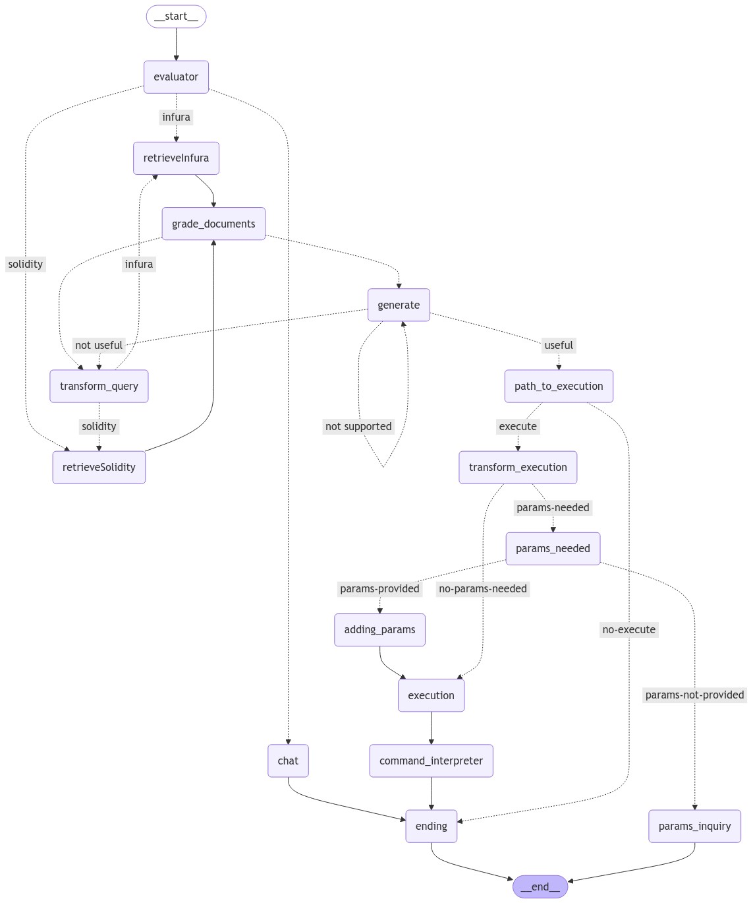

# Web3Buddy

Web3Buddy is an AI-driven chat assistant that helps users navigate the complexities of the Web3 ecosystem. By leveraging AI capabilities through Langraph, Web3Buddy provides real-time insights, answers to Web3-related queries, and guidance on navigating decentralized technologies. The frontend is developed using **Next.js**, while the backend is powered by **FastAPI**, creating a seamless and fast experience for the user.

## Features

- **AI-Powered Web3 Insights**: Leverages Langraph for intelligent, context-aware conversations about Web3 topics.
- **Responsive Next.js Frontend**: Fast, SEO-friendly, and highly responsive client interface for a smooth user experience.
- **Robust FastAPI Backend**: Powers real-time data processing and response generation.
- **Multi-Layered AI Support**: Capable of handling a wide variety of Web3-related questions and queries with personalized, conversational AI.
- **Wallet Integration**: Enables users to connect their wallet to personalize insights and interaction.
- **Dockerized Deployment**: Supports easy deployment via Docker Compose for a containerized environment.

## LangGraph Overview

LangGraph is a library for building stateful, multi-actor applications with LLMs, used to create agent and multi-agent workflows. Compared to other LLM frameworks, it offers these core benefits: cycles, controllability, and persistence. LangGraph allows you to define flows that involve cycles, essential for most agentic architectures, differentiating it from DAG-based solutions. As a very low-level framework, it provides fine-grained control over both the flow and state of your application, crucial for creating reliable agents. Additionally, LangGraph includes built-in persistence, enabling advanced human-in-the-loop and memory features.




## Prerequisites

Before running Web3Buddy, ensure that you have the following installed on your machine:
- **Node.js and npm** for the Next.js client
- **Python 3.x** for the FastAPI server
- **Docker** (optional, but recommended for simplified deployment)

## Installation

### 1. Client Setup (Next.js)

```bash
cd client
npm install
```

Ensure that you have the correct environment variables in the `client/.env.local` file:

```bash
WALLET_PROJECT_ID="your-wallet-project-id"
```

### 2. Backend Setup (FastAPI)

```bash
cd server
pip install -r requirements.txt
```

Ensure that you have the correct environment variables in the `server/.env` file:

```bash
OPENAI_API_KEY='your-openai-api-key'
LANGCHAIN_API_KEY='your-langchain-api-key'
LANGCHAIN_TRACING_V2='true'
LANGCHAIN_ENDPOINT='https://api.smith.langchain.com'
LANGCHAIN_PROJECT='your-langchain-project'
FIRE_API_KEY='your-fire-api-key'
PINECONE_API_KEY="your-pinecone-api-key"
INFURA_API_KEY='your-infura-api-key'
UPSTASH_REDIS_REST_URL="https://your-upstash-redis-url"
UPSTASH_REDIS_REST_TOKEN="your-upstash-redis-token"
```

## Running the Application

### Method 1: Running in Separate Terminals

#### Client (Next.js)

1. Navigate to the `client` directory:

   ```bash
   cd client
   ```

2. Run the development server:

   ```bash
   npm run dev
   ```

#### Backend (FastAPI)

1. Navigate to the `server` directory:

   ```bash
   cd server
   ```

2. Run the FastAPI server:

   ```bash
   python3 app/server.py
   ```

### Method 2: Using Docker Compose

If you prefer using Docker to manage both the client and server:

1. Make sure Docker is installed and running on your machine.

2. In the root of the project directory, run:

   ```bash
   docker-compose up
   ```

This will build the Docker images and start both the client and server as containers, with their respective environment variables loaded from the `.env` files.

## Project Structure

- `/client`: Contains all frontend-related files (Next.js).
- `/server`: Contains all backend-related files (FastAPI).
- `/docker-compose.yml`: Manages the multi-container Docker setup for both services.
